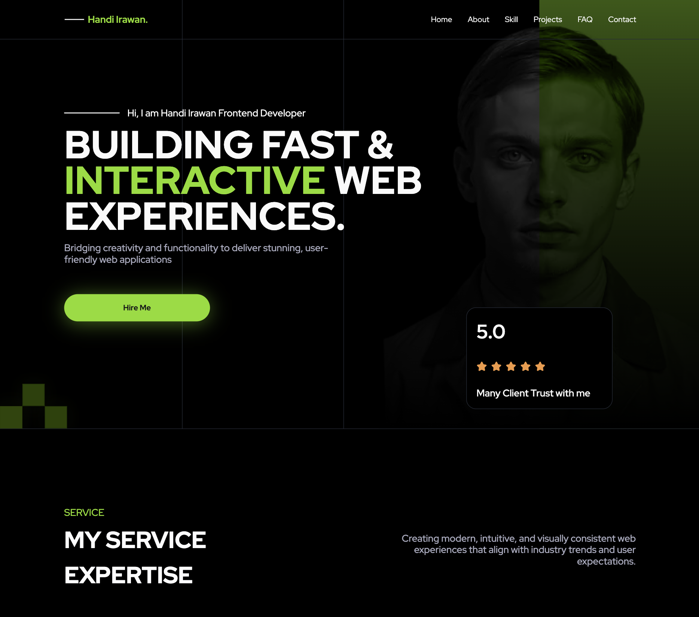
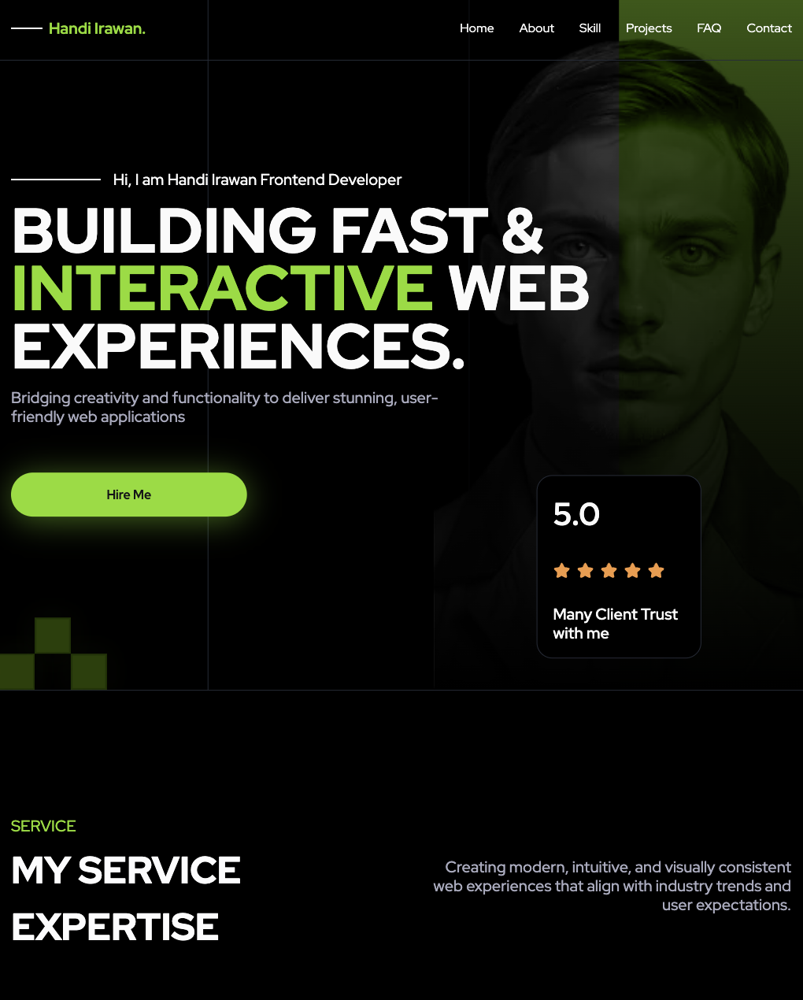
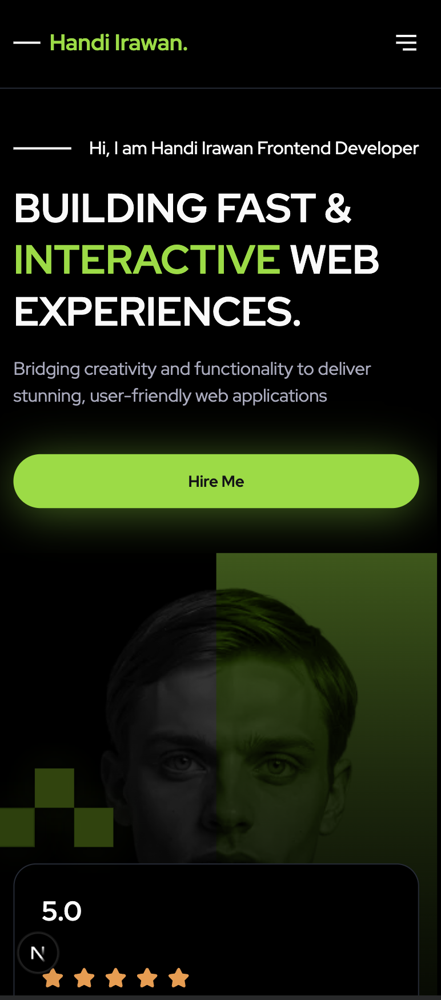

# WPH Portfolio

A polished personal site that packages career highlights, signature projects, and curated contact channels. Built with the Next.js App Router, the experience leans on motion, accessible UI primitives, and content-driven sections to keep everything fast and expressive.

<p align="center">
  
  
  
</p>

> Live demo: [wph-portofolio-8.vercel.app](https://wph-portofolio-8.vercel.app)

## Tech Stack

<p align="center">
  
  
  
  
  
  
  
  
  
</p>

## Highlights

- Story-driven layout with dedicated work, experience, and contact flows
- Motion-based micro-interactions powered by `motion` keep sections lively
- shadcn/ui surfaces layered on Radix primitives ensure accessible dialogs and selects
- Tailwind CSS 4.0 pipeline with custom typography utilities generated at build-time
- Centralized content constants make portfolio refreshes a copy-only task

## Page Modules

- **Work** – Grid of case studies with detail cards sourced from `src/lib/constants/pages/work.ts`
- **Experience** – Timeline-inspired list that reuses shared item components
- **Contact** – Structured list of channels, embedded map card, and CTA copy

## Architecture Overview

```
src/
├── app/                       # Next.js App Router entry points
├── components/
│   └── page/
│       ├── work/              # Work section and cards
│       ├── experience/        # Experience list + item primitives
│       └── contact/           # Contact hero, list, and blocks
└── lib/
    ├── constants/             # Content sources for each page
    └── theme/                 # Tailwind typography generator
```

- `components/page/*` hold presentation logic for each section
- `lib/constants/*` centralizes data for easy editing without touching React code
- `lib/theme/generate-typography.js` builds the typography utilities consumed by Tailwind

## Getting Started

Install dependencies and generate typography utilities:

```bash
npm install
npm run generate:utilities
```

Run the development server:

```bash
npm run dev
```

Visit `http://localhost:3000` to view the site. Changes under `src` hot-reload automatically.

## Available Scripts

| Command         | Description                                 |
| --------------- | ------------------------------------------- |
| `npm run dev`   | Start the Next.js dev server with Turbopack |
| `npm run build` | Create an optimized production build        |
| `npm run start` | Run the production server                   |
| `npm run lint`  | Lint the project with ESLint                |

## Deployment

Deploy via [Vercel](https://vercel.com) or any platform that supports Next.js 16. Ensure that the `prebuild` script (typography generation) runs before `next build`.
